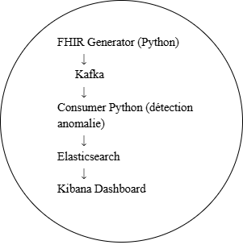
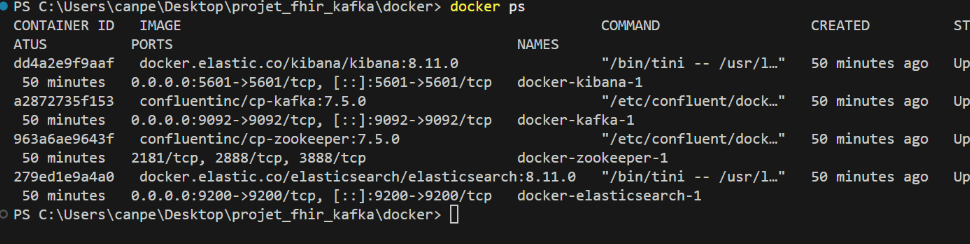
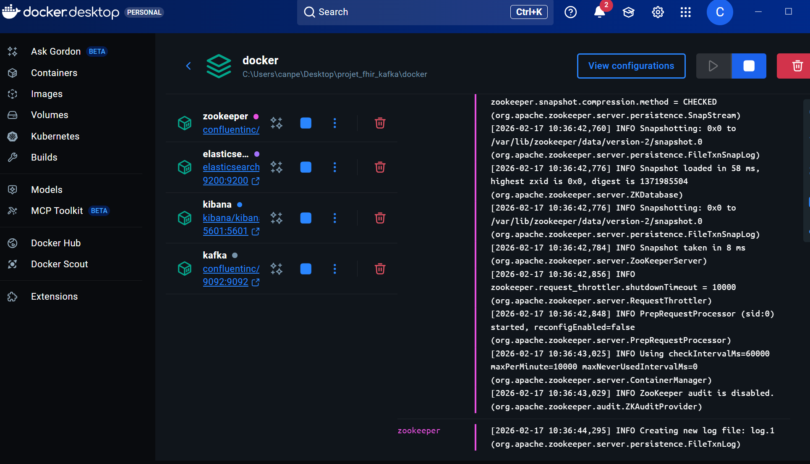
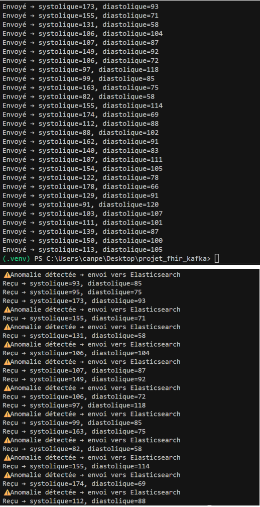
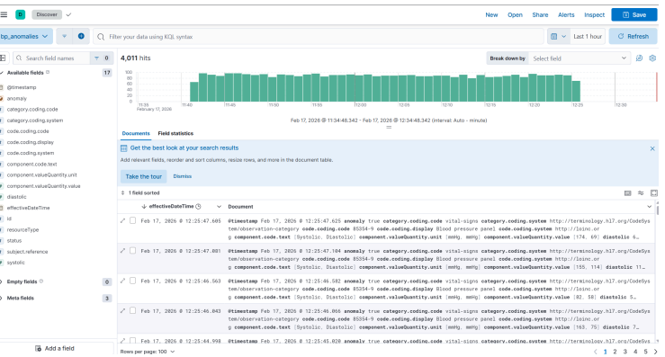
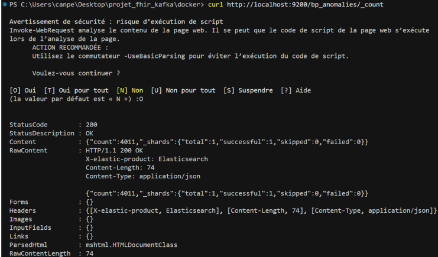
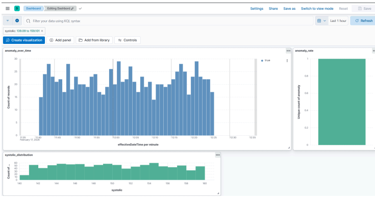

# Projet Streaming de Données Médicales (FHIR + Kafka + Elastic)

## Fonctionnement détaillé du système

Le projet implémente une chaîne complète de traitement de données médicales en temps réel basée sur une architecture Big Data.  
L’objectif est de simuler la surveillance continue de la pression artérielle de patients et de détecter automatiquement les anomalies.

Le pipeline suit les étapes suivantes :

Patient → Génération FHIR → Kafka → Analyse → Elasticsearch → Kibana

### 1. Génération des données médicales (FHIR)

Un module Python simule des patients et génère des mesures de pression artérielle :
- Pression systolique
- Pression diastolique

Chaque mesure est encodée au format standard médical **FHIR (Fast Healthcare Interoperability Resources)** sous forme de ressource *Observation*.

Ce standard est utilisé dans les systèmes hospitaliers réels car il permet l’interopérabilité entre logiciels médicaux.

Les données produites représentent donc des observations médicales réalistes et structurées.

---

### 2. Streaming temps réel avec Kafka

Les observations FHIR sont envoyées dans un topic Kafka par un Producer Python.

Kafka agit comme un système de transport de données en continu :
- il reçoit les mesures
- les stocke temporairement
- les distribue aux applications consommatrices

Cette étape simule un capteur médical connecté qui envoie les données en continu depuis un hôpital ou un dispositif IoT.

Le streaming permet de traiter les données immédiatement sans attendre un traitement batch.

---

### 3. Consommation et analyse médicale

Un Consumer Python lit les messages depuis Kafka et effectue une analyse clinique.

Les règles médicales utilisées sont basées sur des seuils réels :

| Type | Condition |
|----|----|
| Hypotension | systolique < 90 ou diastolique < 60 |
| Hypertension | systolique > 140 ou diastolique > 90 |

Chaque observation est classée :

- **Normale**
- **Anormale (anomalie détectée)**

Cette étape représente un système d’aide à la décision médicale automatisé.


### 4. Traitement des résultats

Selon le résultat de l’analyse :

#### Cas normal
Les données sont archivées localement en fichier JSON.
Cela simule un stockage patient standard sans alerte médicale.

#### Cas anormal
Les données sont envoyées vers Elasticsearch avec des métadonnées :
- valeur systolique
- valeur diastolique
- type d’anomalie
- timestamp

Cela représente un cas nécessitant une surveillance médicale.

### 5. Indexation dans Elasticsearch

Elasticsearch sert de base de données orientée recherche.

Il permet :
- stockage rapide
- requêtes temps réel
- agrégations statistiques

Chaque anomalie devient un document indexé consultable immédiatement.

### 6. Visualisation dans Kibana

Kibana permet d’exploiter les données indexées pour la supervision médicale.

Les tableaux de bord affichent :

- évolution temporelle des anomalies
- distribution des pressions artérielles
- taux d’anomalies
- détection de pics critiques

Le système devient alors un tableau de monitoring patient en temps réel.

## Fonctionnement global

Le projet simule un système hospitalier moderne :

1. Capteurs médicaux → génèrent les mesures
2. Kafka → transporte les données en continu
3. Analyse Python → détecte les anomalies
4. Elasticsearch → stocke les cas critiques
5. Kibana → permet au personnel médical de surveiller

Cette architecture correspond aux systèmes de télésurveillance médicale utilisés dans les hôpitaux connectés.

Le traitement se fait en continu et permet de détecter rapidement les situation a des riques.

## Architecture

## 🏗️ Architecture du système


Python Generator → Kafka → Python Consumer → Elasticsearch → Kibana

Ce pipeline reproduit un système de surveillance médicale continu (monitoring patient)

##  Résultats et preuves d’exécution

###  Infrastructure Docker lancée


###  Containers actifs dans Docker Desktop


###  Producer envoi des données


###  Détection d’anomalies + envoi Elasticsearch


###  Données stockées dans Elasticsearch


###  Dashboard Kibana temps réel


## Données traitées

* Systolique
* Diastolique
* Détection d'anomalies tension artérielle

## Technologies

* Python
* Kafka
* Elasticsearch
* Kibana
* Docker
* FHIR

## Description
Génération de messages FHIR (Observation - pression artérielle), envoi dans Kafka, détection d’anomalies, stockage dans Elasticsearch et visualisation dans Kibana.

## Prérequis
- Docker Desktop
- Python 3.11+
- pip

## Installation Python
```bash
python -m venv .venv
.\.venv\Scripts\Activate.ps1
pip install -r requirements.txt

## 🔁 Reproductibilité

Le projet peut être relancé entièrement avec Docker.

### 1. Installer les dépendances Python
python -m venv .venv
.\.venv\Scripts\activate
pip install -r requirements.txt

### 2. Lancer l’infrastructure
cd docker
docker compose up -d

### 3. Lancer le pipeline
python -m consumer.consumer
python -m producer.producer

### 4. Ouvrir la visualisation
http://localhost:5601


## Technologies utilisées et rôle dans l’architecture

Le projet repose sur une architecture distribuée composée de plusieurs outils Big Data spécialisés.  
Chaque composant a un rôle précis dans la chaîne de traitement.

---

### FHIR (Fast Healthcare Interoperability Resources)

FHIR est un standard international utilisé dans les systèmes médicaux pour échanger des données de santé.

Dans ce projet, il sert à :
- structurer les observations médicales
- rendre les données interopérables
- simuler un système hospitalier réel

La ressource utilisée est **Observation**, qui permet de représenter une mesure médicale comme la pression artérielle.

L’utilisation de FHIR permet de rendre le projet réaliste et compatible avec les logiciels hospitaliers modernes.

---

### Apache Kafka

Kafka est une plateforme de streaming distribuée utilisée pour transporter des données en temps réel.

Dans le projet, Kafka joue le rôle de bus de communication :

- le Producer envoie les observations médicales
- le Consumer les récupère immédiatement

Avantages apportés :
- traitement temps réel
- découplage des services
- scalabilité
- tolérance aux pannes

Kafka simule un flux continu provenant de capteurs médicaux connectés.

---

### Python

Python est utilisé pour implémenter la logique métier du système :

- génération de données patients
- conversion en format FHIR
- publication dans Kafka
- analyse clinique
- détection d’anomalies
- envoi vers Elasticsearch

Il agit donc comme moteur d’intelligence du système.

---

### Elasticsearch

Elasticsearch est une base de données orientée recherche optimisée pour les données volumineuses et temps réel.

Dans le projet il sert à :

- stocker uniquement les cas anormaux
- permettre des recherches rapides
- agréger les statistiques médicales
- préparer les données pour la visualisation

Il représente la base de surveillance médicale.

---

### Kibana

Kibana est l’outil de visualisation connecté à Elasticsearch.

Il permet :

- créer des tableaux de bord médicaux
- suivre les patients à risque
- visualiser les tendances
- détecter les pics critiques

C’est l’interface utilisateur finale du système.

---

### Docker

Docker permet d’exécuter toute l’infrastructure sans installation complexe.

Il garantit :

- reproductibilité du projet
- déploiement simple
- environnement identique sur toutes les machines

Les services lancés par Docker Compose :
- Zookeeper
- Kafka
- Elasticsearch
- Kibana

Un simple `docker compose up` permet de démarrer toute la plateforme.

---

## Résumé de l’architecture

| Composant | Rôle |
|--------|------|
| FHIR | Standard médical des données |
| Python | Logique et analyse |
| Kafka | Transport temps réel |
| Elasticsearch | Stockage des anomalies |
| Kibana | Visualisation |
| Docker | Reproductibilité |

## Conclusion

Ce projet met en place une chaîne complète de traitement de données médicales en temps réel.

Nous avons construit une architecture Big Data permettant :

- la génération de données patients au format FHIR
- la transmission continue via Kafka
- l’analyse clinique automatisée
- la détection d’anomalies médicales
- le stockage ciblé des cas critiques
- la visualisation interactive dans Kibana

Le système reproduit le fonctionnement d’une plateforme de télésurveillance médicale où des capteurs envoient en continu les constantes vitales des patients.

L’utilisation de technologies distribuées permet d’assurer :
- rapidité de traitement
- fiabilité
- extensibilité
- surveillance en temps réel

Ainsi, ce projet démontre concrètement comment une architecture Big Data peut être appliquée au domaine de la santé pour améliorer le suivi des patients.

---

## Limites actuelles

Le système repose actuellement sur des seuils médicaux fixes pour détecter les anomalies.  
Cela fonctionne mais reste limité car tous les patients sont analysés de la même manière.

Un patient sportif ou âgé peut avoir des valeurs normales différentes.

---

## Amélioration possible : Machine Learning (optionnel)

Une amélioration consiste à ajouter un modèle de Machine Learning capable d’apprendre les comportements normaux d’un patient.

Principe :

1. Collecter un historique de mesures
2. Entraîner un modèle de classification (ex : régression logistique)
3. Prédire le risque en temps réel dans le consumer Kafka

Le système passerait alors d’une détection par règles à une détection intelligente personnalisée.

Cela permettrait :
- moins de faux positifs
- détection précoce
- adaptation au patient

---

## Reproductibilité

Le projet est entièrement reproductible grâce à Docker.

Pour relancer le système sur une nouvelle machine :

git clone https://github.com/CanPekgoz/projet_fhir_kafka.git
cd projet_fhir_kafka

# créer venv
python -m venv .venv
.\.venv\Scripts\activate

# installer dépendances
pip install -r requirements.txt

# démarrer l’infra
cd docker
docker compose up -d
cd ..

# lancer consumer
python -m consumer.consumer

# lancer producer (dans un 2e terminal)
python -m producer.producer

Et ajoute les URLs :
	•	Kibana : http://localhost:5601
	•	Elasticsearch : http://localhost:9200
